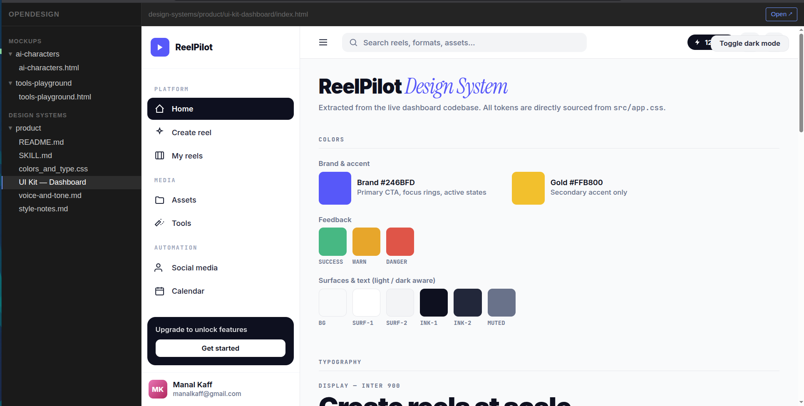
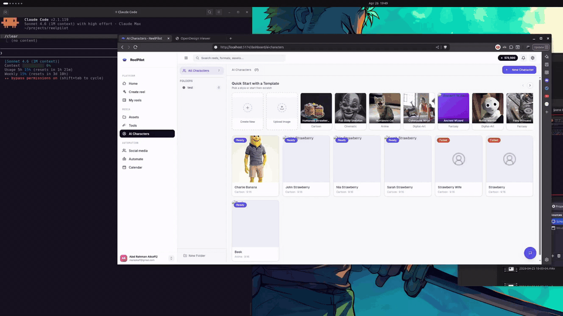
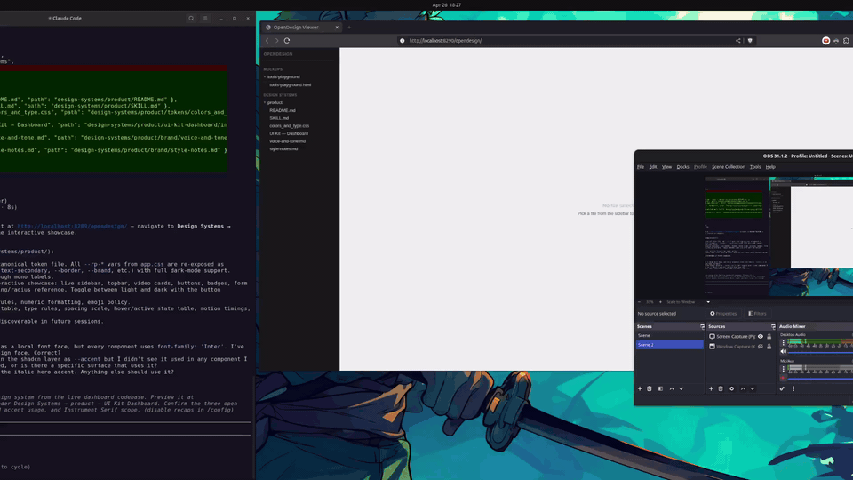

# OpenDesign

## Why this exists

Claude Design on claude.ai is excellent. But it's locked.

Locked to the browser. Locked to Anthropic models. Locked to the web app — which means no access to your local files, no integration with your existing design system, and no way to use it inside the editor where your actual work happens.

I built OpenDesign to fix that. Same philosophy as Claude Design — structured intake, context-matching, taste, a verifier that checks the output against the brief — but packaged as portable markdown skills you can install in Claude Code, Cursor, Codex, Gemini CLI, or OpenCode. It runs locally, reads your codebase, and works with whatever model you're on.

You own it. You can read every skill, fork it, and extend it.

## What it does

OpenDesign turns your AI coding agent into a designer with taste, opinions, and the discipline to restrain them. HTML is the output medium. Inside that medium it embodies whichever specialist the task calls for — deck designer, UX designer, prototyper, brand designer.

It doesn't generate generic AI output. It reads your actual codebase first.


*OpenDesign extracting a live design system from a real codebase — colors, typography, tokens, all sourced directly from `src/app.css`.*

## Showcase





Ten skills ship together. One is the entry point (`opendesign`); the others are loaded on demand by the workflow.

## Available skills

<!-- SKILLS:START -->

| Skill | Use when |
|---|---|
| `opendesign` | Starting any design task. Establishes the base role, workflow, and taste rules, and routes to specialist skills. |
| `setup-opendesign` | Initialising OpenDesign for the first time in a project. Creates output folders, copies the viewer, and writes an empty manifest. Called automatically by `opendesign` — rarely needed directly. |
| `run-opendesign` | Starting the preview server after a build. Serves `./opendesign/` on port 8289, handles duplicate prevention and python/node detection, and prints a clickable link. Called automatically by `opendesign` — rarely needed directly. |
| `create-design-system` | Producing a reusable design system or UI kit from an existing brand, codebase, or product. |
| `frontend-design` | Designing without an existing brand system. Pushes for a committed, distinctive aesthetic. |
| `wireframe` | Exploring the design space quickly — many rough ideas, not one polished direction. |
| `interactive-prototype` | Asking for a working, clickable prototype that behaves like a real app. |
| `make-a-deck` | Asking for a slide presentation. Fixed 1920×1080 canvas, chapter-driven titles. |
| `make-tweakable` | Wanting in-design controls for toggling variants, colors, copy, or feature flags. |
| `handoff-to-claude-code` | Handing a finished design off to a developer or coding agent for implementation. |

<!-- SKILLS:END -->

## How the skills work together

`opendesign` is the front door. On invocation it:

1. Scans `./opendesign/design-systems/*/` for existing systems (looking for `SKILL.md` or `tokens/colors_and_type.css` as markers).
2. Announces what it found and picks the right one, asks, or offers to create one.
3. Runs a structured intake if the work is new.
4. Routes to the specialist skill for the artifact (deck → `make-a-deck`, prototype → `interactive-prototype`, etc.).
5. Forks a verifier subagent to review against the brief.

Design systems created by `create-design-system` are written to `./opendesign/design-systems/<name>/` so `opendesign` can auto-discover them in future sessions. Multiple systems per project are supported — a marketing system, a product system, a deck template — and the agent picks based on task shape.

## Installation

**Note:** Installation differs by platform.

### Claude Code

```bash
/plugin marketplace add manalkaff/opendesign
/plugin install opendesign@opendesign
```

### Cursor

In Cursor Agent chat:

```text
/add-plugin opendesign
```

Or search for "opendesign" in the plugin marketplace.

### OpenAI Codex CLI

Open the plugin search:

```bash
/plugins
```

Search for `opendesign` and select **Install Plugin**.

### OpenAI Codex App

In the Codex app, click **Plugins** in the sidebar, find **OpenDesign** in the Design section, click the `+`, and follow the prompts.

### Gemini CLI

```bash
gemini extensions install https://github.com/manalkaff/opendesign
```

To update:

```bash
gemini extensions update opendesign
```

### OpenCode

Tell OpenCode:

```
Fetch and follow instructions from https://raw.githubusercontent.com/manalkaff/opendesign/main/.opencode/INSTALL.md
```

### Fork

Fork the repo, add your own skills under `skills/`, and install your fork through whichever host you use.

## Usage

Once installed, invoke with `/opendesign` and describe what you want. The agent picks up the right skills on its own.

```
/opendesign make a pitch deck for a seed-stage AI company, 10 slides
```

```
/opendesign design a settings page for this React app — use our existing design system
```

```
/opendesign explore a few options for the onboarding flow. rough sketches, nothing polished yet
```

```
/opendesign extract our design system from the codebase and document it
```

## Upgrading

If you installed via the plugin marketplace, run `/plugin update opendesign` inside Claude Code.

If you cloned or submoduled, `git pull` in the repo.

## Contributing

See [CONTRIBUTING.md](CONTRIBUTING.md). Quality bar is higher than coverage — consider extending an existing skill before adding a new one.

## License

[MIT](LICENSE)
